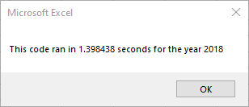
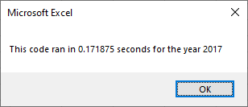
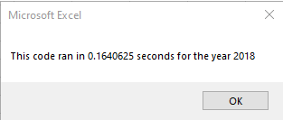

# VBA of Wall Street

## Overview of Project

This project is an analysis of a selection of stock market data from the years 2017 and 2018. We use Microsoft Excel and VBA scripts to analyze the data from twelve different companies and calculate the total daily volume traded and the yearly return.

### Purpose

We are helping Steve automate the analysis of data on stocks he has chosen. His parents are currently only invested in one stock and he wants to help choose more for them. In addition, it is important that the script runs quickly and efficiently so that Steve can run it on any stock data that he wants to.

## Analysis

### Stock Perfomance

After performing the analysis for the years 2017 and 2018, it's immediately apparent that in 2018 almost all stocks had a negative return on investment, while in 2017 almost all stocks had a positive return on investment. Only **ENPH** and **RUN** had positive returns for both years. The stocks of *SEDG* and *VSLR* had good returns in 2017 and only slightly negative returns in 2018. Without further analysis and comparison it's hard to make any other conclusions, but I would recommend those four stocks for Steve's parents. 

### Code performance

The refactored script ran approximately eight times faster than the original script, as seen in the screenshots below. 
> \
>Runtimes for the orignal script.

> \
>Runtimes for the refactored script.

## Summary

In summary, the VBA scripts are a powerful tool for working with data in Microsoft Excel, even though they are a big security risk. Refactoring the script was able to get a large increase in efficiency.

### Advantages and Disadvantages of Refactoring

### Advantages and Disadvantages of our VBA Script
